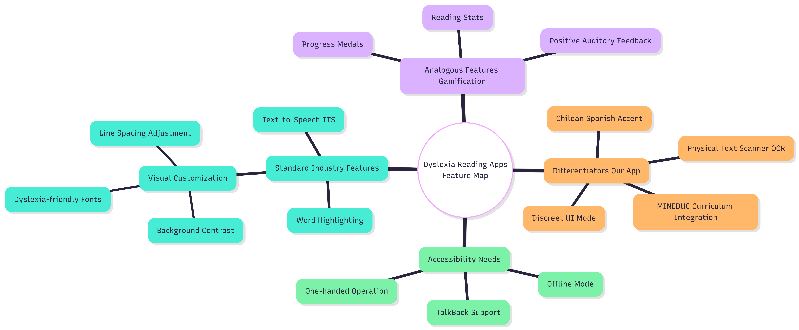
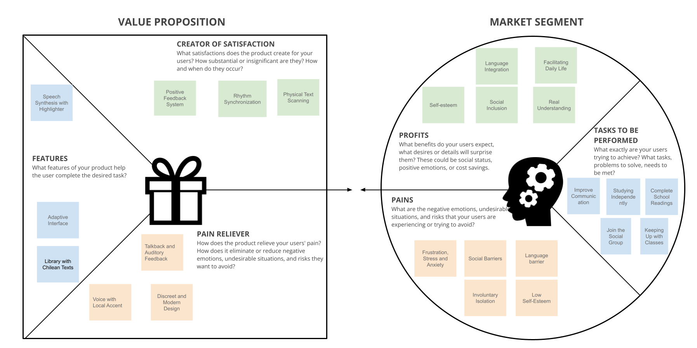
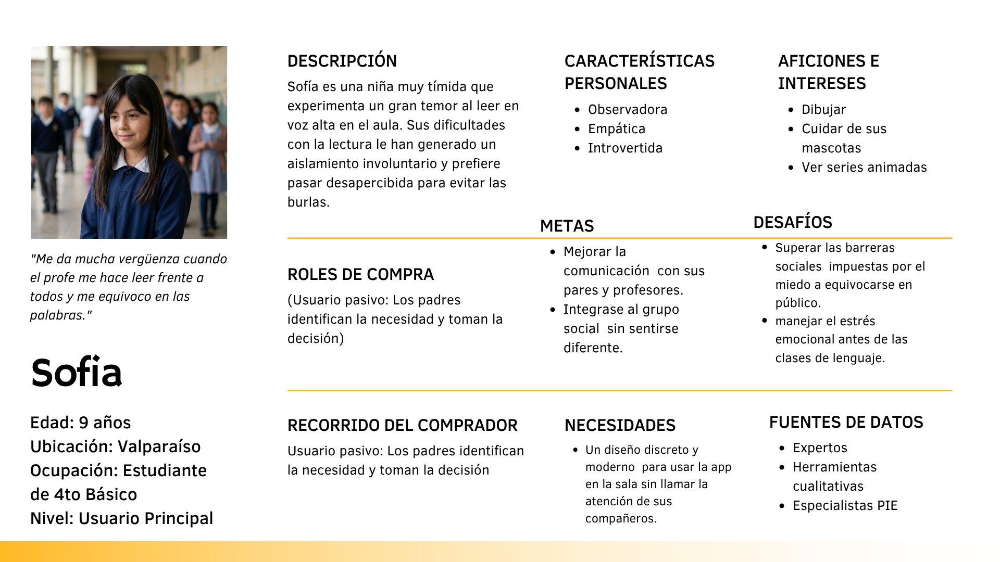
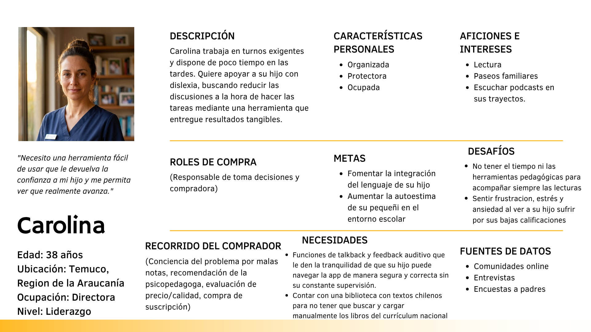
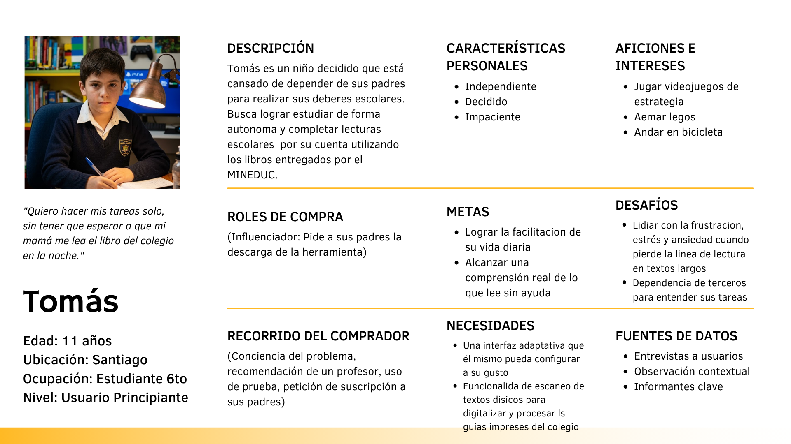
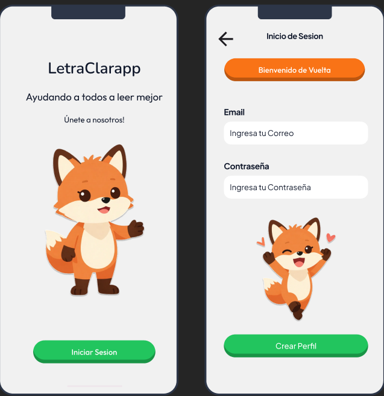
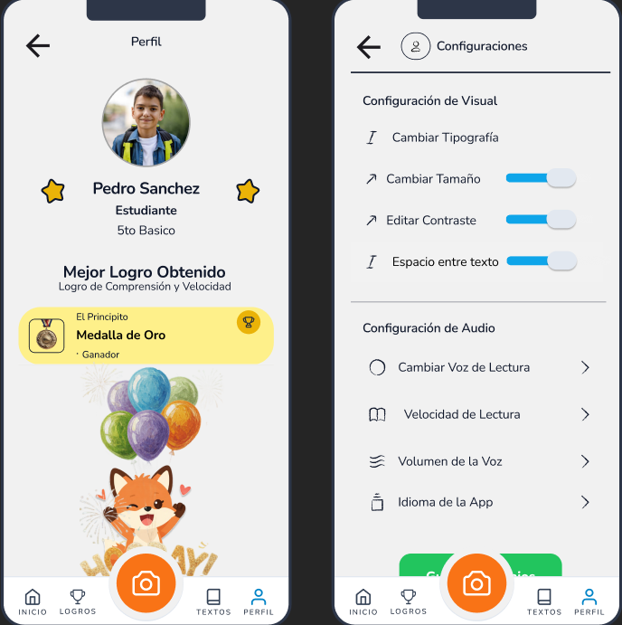

# (LetraClarapp CL) 

**LetraClarapp** es una aplicación de apoyo a la lectura diseñada específicamente para niños de entre 8 y 12 años con dislexia en el sistema escolar chileno. Nuestra propuesta se enfoca en ofrecer una interfaz discreta, moderna y completamente adaptada al currículum del MINEDUC, permitiendo a los estudiantes seguir las clases sin sentirse diferentes a sus compañeros.

---

## Integrantes
* Rayen Ancamilla
* Eduardo Gómez
* Raul Manriquez

---

## Índice
1. [Introducción y Problemática](#1-introducción-y-problemática)
2. [Benchmark Competitivo](#2-benchmark-competitivo)
3. [Mapa de Características (Feature Map)](#3-mapa-de-características-feature-map)
4. [Canvas de Propuesta de Valor](#4-canvas-de-propuesta-de-valor)
5. [Arquitectura de Información y Navegabilidad](#5-arquitectura-de-información-y-navegabilidad)
6. [Personas UX](#6-personas-ux)
7. [Propuesta de Baja Fidelidad y Prototipos](#7-propuesta-de-baja-fidelidad-y-prototipos)

---

## 1. Introducción y Problemática

La dislexia afecta aproximadamente al 10% de la población escolar y representa un desafío de diseño de alto impacto. Elementos como la tipografía especializada, el espaciado, el contraste, la síntesis de voz y la retroalimentación positiva deben coexistir armónicamente en la interfaz.

Las aplicaciones existentes suelen ser genéricas o de origen extranjero, careciendo de adaptación al español chileno y a los textos curriculares nacionales. **ReadEase** resuelve esto integrando las lecturas oficiales del MINEDUC y utilizando motores de texto a voz (TTS) con acento local para evitar la robotización.

---

## 2. Benchmark Competitivo

Realizamos un análisis comparativo con soluciones de la industria y referencias de diseño análogas:

| Dimensión de Análisis | Voice Dream Reader | Google Read Along | Spotify (Ref. Diseño) | Nuestra Propuesta (ReadEase) |
| :--- | :--- | :--- | :--- | :--- |
| **Usuario Objetivo** | Adultos y estudiantes con DEA | Niños pequeños (5-11 años) | Público general, oyentes | Niños (8-12 años) con dislexia en Chile |
| **Propuesta de Valor** | Lector de texto a voz premium personalizable | Tutor de lectura con IA y gamificación | Experiencia de escucha fluida y limpia | App discreta adaptada a Chile y MINEDUC |
| **Navegación** | Barra inferior (Biblioteca, Ajustes) | Flujo guiado por mapa de niveles | Barra inferior con reproductor persistente | Barra inferior (Biblioteca, Escáner, Logros, Perfil) |
| **Accesibilidad** | Alta (Fuentes dislexia, alto contraste) | Media (Íconos grandes, sin ajustes finos) | Alta (Vista de auto, intuitiva) | Alta (Feedback auditivo, TalkBack, alto contraste) |
| **Integración MINEDUC**| No. Carga manual de textos | No. Historias genéricas cortas | N/A | Sí. Biblioteca precargada con textos escolares |
| **Adaptación Chilena**| Sí, pero usa el motor del OS (robótico) | No. Español neutro/latino | N/A | Sí. Voces TTS con acento local y vocabulario adaptado |
| **Discreción en Clases**| Baja (Interfaz compleja/utilitaria) | Ninguna (Gamificación ruidosa e invasiva) | Alta (Interfaz oscura y minimalista) | Alta (Interfaz moderna y "normal", uso con audífonos) |

---

## 3. Mapa de Características (Feature Map)

El siguiente mapa conceptual detalla las funcionalidades requeridas para satisfacer las necesidades de accesibilidad, gamificación análoga y los diferenciadores de nuestra aplicación:

  

---

## 4. Canvas de Propuesta de Valor

Analizamos las frustraciones (Pains), alegrías (Gains) y tareas del segmento de mercado de los estudiantes y apoderados frente al diseño de los aliviadores y creadores de satisfacción de ReadEase:

  

---

## 5. Arquitectura de Información y Navegabilidad

Diseñamos un mapa de navegación intuitivo que divide la aplicación en 4 pilares clave accesibles desde un menú persistente inferior, facilitando un acceso rápido al escáner de textos físicos (OCR) y al modo de lectura activa:

  

---

## 6. Personas UX

Para guiar nuestras decisiones de diseño, creamos tres perfiles basados en la investigación de usuarios:

  
  
  

* **Sofía (9 años, Valparaíso):** Estudiante de 4to básico. Siente mucha ansiedad al leer en voz alta frente a sus compañeros y prefiere pasar desapercibida para evitar burlas. Necesita un diseño discreto.
* **Carolina (38 años, Temuco):** Apoderada y Directora. Dispone de poco tiempo en las tardes y busca una herramienta fácil de usar que le devuelva la confianza a su hijo mediante resultados visibles.
* **Tomás (11 años, Santiago):** Estudiante de 6to básico. Quiere hacer sus tareas de manera autónoma sin depender de que sus padres le lean los libros obligatorios del MINEDUC por la noche.

---

## 7. Propuesta de Baja Fidelidad y Prototipos

A continuación se presentan las pantallas de baja fidelidad que componen el flujo principal de la aplicación, incluyendo el onboarding, la configuración de accesibilidad visual/auditiva y el panel de progreso diario:

### Onboarding y Configuración de Perfil

  

### Configuración Personalizada (Visual y de Audio) y Dashboard Principal
La aplicación permite modificar la tipografía, el tamaño, el contraste y el espaciado del texto, además de ajustar la velocidad y el tipo de voz de lectura.

  

### Gestión de Lecturas, Escáner OCR y Biblioteca MINEDUC
El núcleo de la aplicación permite escanear un documento físico instantáneamente o revisar libros escolares vigentes como *El Principito* o *Matilda* mientras se realiza un seguimiento en tiempo real de los objetivos logrados.

  

---
*Proyecto desarrollado para la asignatura de Interacción Humano-Computadora (HCI).*
